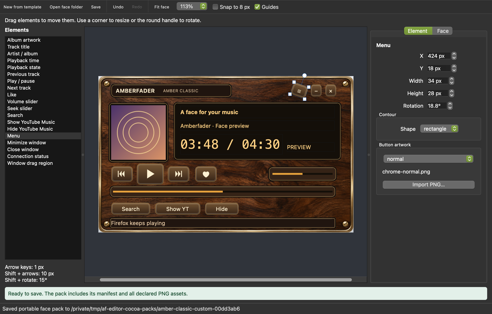

# Face editor

The face editor runs as a standalone PySide6 application on macOS and Linux.
It previews and edits the same portable face folders that the player loads.
You can design a face without Firefox, the native helper, or a playing track.
The standalone editor does not provide a macOS playback bridge.

The editor and rotation support are available in builds from this source tree;
the v0.1.9 release predates them. Use an updated player build to load a face
that declares `controlRotations`.



From a source checkout:

```sh
uv sync --extra gui
uv run amberfader-face-editor
uv run amberfader-face-editor /path/to/custom-face
uv run amberfader-face-editor /path/to/custom-face/face.json
```

On Linux, the installed command is `amberfader-face-editor`. With the Flatpak:

```sh
flatpak run --command=amberfader-face-editor ch.lkmc.amberfader
```

Flatpak file access follows its sandbox permissions. Choose an accessible folder
or grant access to the destination when starting the editor.

## Create and edit

Choose a bundled face as your starting template. The editor creates a custom
copy with its own ID and name; it never saves over the bundled artwork. You can
also use **Face editor…** in the player's menu or **Edit a copy…** in the face
picker to start with that face.

Select a control on the canvas or in the control list. Drag it to move it, resize
it with its handles, or adjust its exact position and size in the inspector.
Use the round rotation handle to turn it; hold Shift to snap to 15-degree angles.
Arrow keys move the selected control by one pixel, or ten pixels with Shift.
The inspector also edits its angle, shape, and screen typography. The canvas
shows your current background, sprites, cover aperture, labels, and sliders.
Use zoom and **Snap to 8 px** for placement; hold Option on macOS or Alt on Linux
to bypass the grid during a gesture. Undo or redo to compare edits. A move,
resize, or rotation gesture is one undo step.

The face's drag region is editable too. Keep it clear of playback controls so
the player can distinguish a window drag from a control press. Screen labels,
buttons, artwork, and sliders must fit inside the canvas and avoid each other.
The editor shows validation problems while you arrange controls and blocks
invalid saves. A draft preview can show overlapping controls while you work.

Use the properties panels to adjust the name, ID, author, description, palette,
font, slider style, and cover glass. Per-screen font, size, alignment, and bold
overrides use the same rendering as the player and picker. Reset an override to
use the face defaults.

## Backgrounds and sprites

Import a PNG background or a button-state sprite through the inspector, or drop
a PNG on the canvas and choose how to use it. Imported bytes become part of the
document immediately, so moving or deleting the original image does not break
your face. Names are generated inside the exported face folder, with no absolute
paths or external references.

A background must match the canvas at 1x or 2x. Changing the canvas size requires
a matching background and enough room for every control. Supported button
sprite states are normal, hover, pressed, and disabled; import normal first.
Sprites are drawn within each button's logical rectangle, then rotated with the
button. Supply unrotated sprites to avoid applying an angle twice.

The existing face limits apply: a 64 KiB manifest, 4 MiB per PNG, 16 MiB of
declared images per face, and image dimensions up to 2048 pixels. Undo retains
at most 100 steps and 64 MiB of unique PNG bytes across document snapshots.

## Rotated controls

Version 2 faces accept `controlRotations`, a map of control names to angles in
degrees. Positive angles rotate clockwise around the center of the logical
control rectangle. Angles range from -180 to 180; a missing angle means zero.
Buttons, sliders, labels, and the cover aperture can rotate. The window drag
region remains axis aligned.

```json
{
  "formatVersion": 2,
  "controls": { "play": [100, 200, 60, 48] },
  "controlRotations": { "play": -15 }
}
```

This is a fragment, not a complete face manifest. Keep the full required control
set when editing a manifest by hand. Rotation applies to the visual and its
pointer interaction together. Its transformed footprint must remain inside the
canvas and clear of other controls and the drag region. Use the editor's outline
and validation feedback to check the actual rotated footprint.

## Save and install

**Save As** writes an ordinary folder containing `face.json` and only its
declared PNG assets. Choose a new or empty folder. After saving, **Save** updates
that working folder. **Export copy…** writes another portable copy without
moving the working document or marking unsaved work as saved.

Save validates the complete staged snapshot before publishing it. Existing
folders and unrelated files are protected: if a working folder changes outside
the editor or gains additional files, reopen it or use Save As. If publishing
fails, the editor restores the previous folder. If restoration also fails, its
error identifies the recovery folder containing the original bytes.

Install an exported folder through **Install face…** in the player's face picker.
Installation still validates the same data-only format and does not overwrite a
face with an existing ID. Keep your editable working copy separately if you plan
to revise it after installation. See [Faces](faces.md) for the pack format.

## Verification on each platform

Run the editor on macOS and Linux, open a bundled template, and move, resize,
rotate, undo, and redo a button and slider. Confirm the preview follows the
handles and inspector values. Import a PNG, remove the source file, save to a
new folder, close the editor, and reopen that folder. Check that geometry,
typography, sprites, and angles survive unchanged. Try overlapping controls and
confirm saving is blocked until the layout is valid.

On Linux, install the exported face in the player. Check click and keyboard
focus on angled buttons, drag both ends of an angled slider, and switch faces
while using the controls. Player actions retain their existing command guards;
editor preview controls do not send playback commands.
