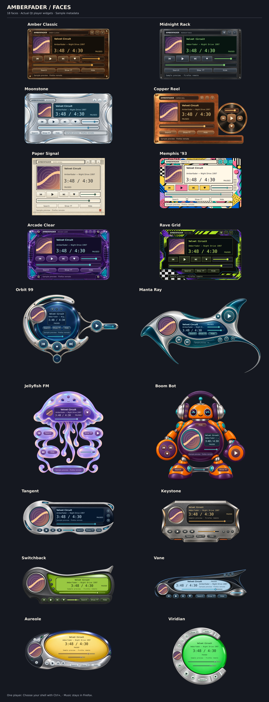
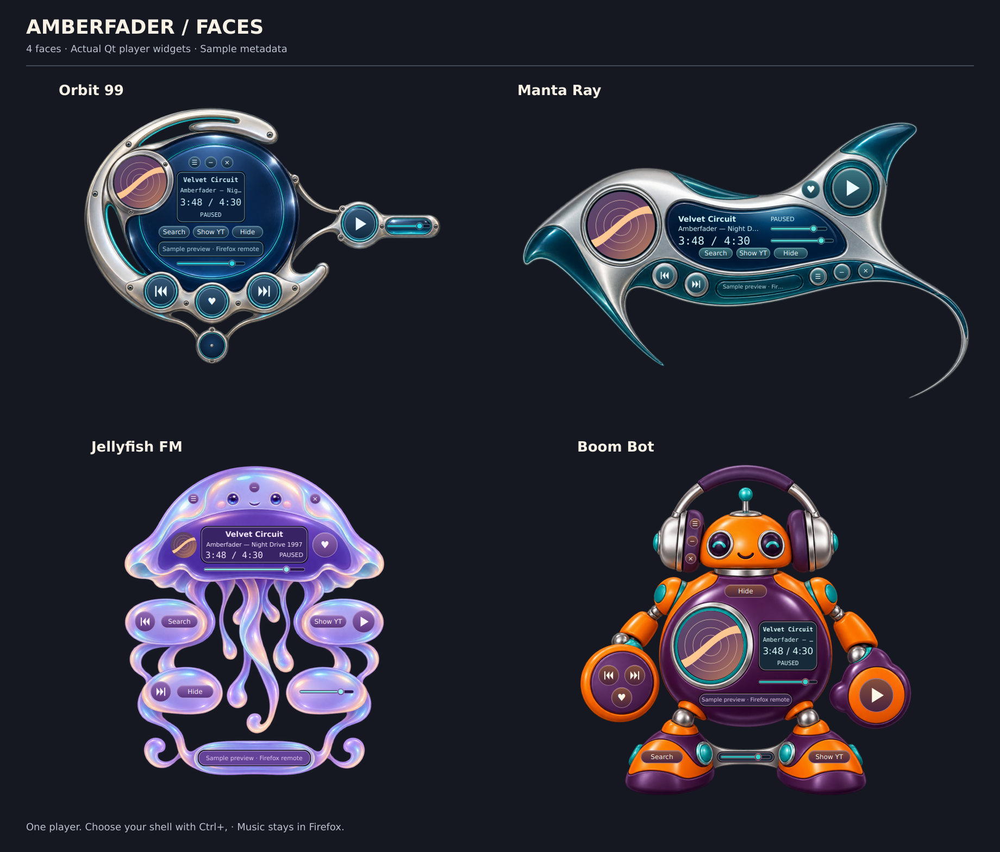
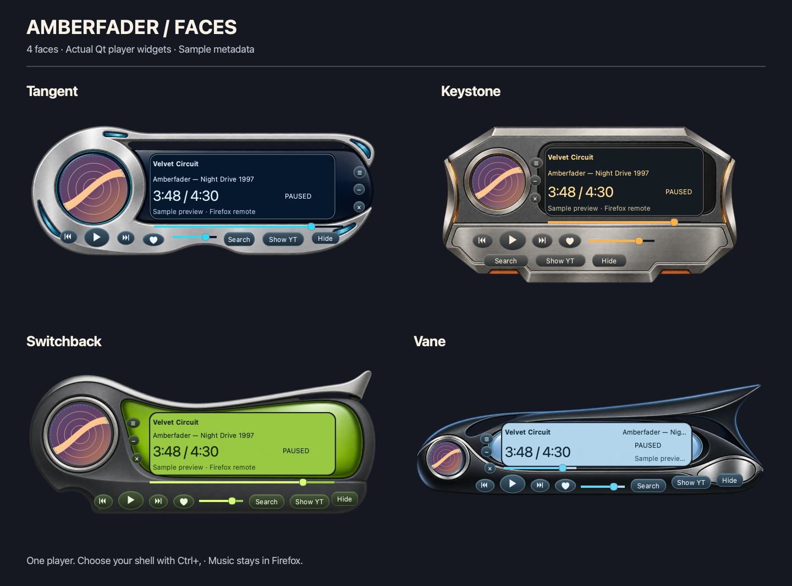
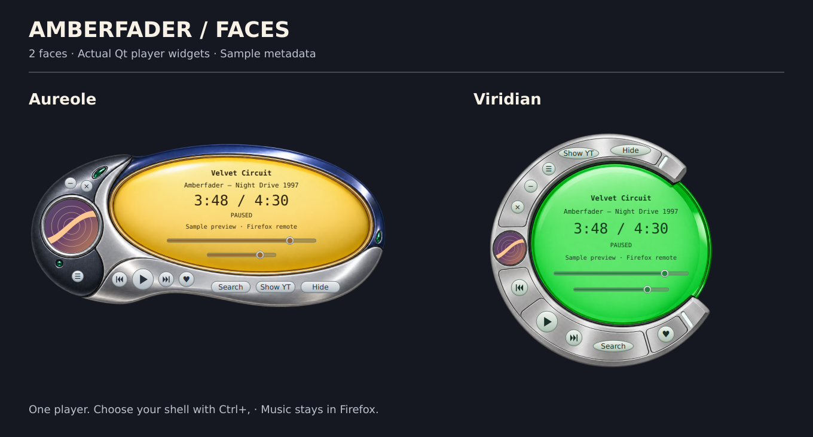

# Linux Faces

Open **☰ → Faces…**, or press **Ctrl+,**. Select a face, inspect its preview,
then click **Use face**. Your choice survives app restarts.

Faces change the native player's silhouette, layout, textures, fonts, buttons
and palette. The same controls and state remain in place: switching faces
does not interrupt playback, clear a search, cancel a request, or change a like.
Search, recents and **Start mix** use the face's palette. Click the cover, or
choose **Cover view** from the menu, for a larger artwork window.

## Included faces



| Face | Character |
| --- | --- |
| Amber Classic | Dark walnut, warm amber glass, compact hi-fi controls |
| Midnight Rack | Graphite rack rails and a green phosphor readout |
| Moonstone | Flowing chrome and satin aluminum, blue glass |
| Copper Reel | Brushed copper shell, warm dark display, circular transport pod |
| Paper Signal | Classic-Mac pinstripes, tactile cream paper, larger cover sleeve |
| Memphis ’93 | Radical 90s squiggles, checkerboards, pink and turquoise screen print |
| Arcade Clear | Translucent grape plastic, circuitry, cyan accents |
| Rave Grid | Acid lime, ultraviolet, halftones, laser cyan and clipped corners |
| Orbit 99 | An orbital chrome instrument with curved rails and satellite controls |
| Manta Ray | Swept silver wings, deep blue glass and a curling tail |
| Jellyfish FM | A pearlescent purple jellyfish with controls on its floating pods |
| Boom Bot | An orange and purple headphone robot with controls on its body and limbs |
| Tangent | A silver and navy crescent with compact instrument controls |
| Keystone | A clipped steel badge with an amber display |
| Switchback | A swept graphite shell with lime accents and an LCD |
| Vane | A dark aerodynamic fin with ice blue glass |
| Aureole | A gold oval display in a silver and navy shell |
| Viridian | A green round lens framed by a silver crescent |

The four experimental sculptural faces place the player controls in curved
instruments and characters, with transparent gaps between parts of the shell.



Tangent, Keystone, Switchback and Vane use compact abstract instrument forms,
with shaped metal and plastic shells around the readout and controls.



Aureole and Viridian place oval and round glass displays inside curved silver
shells, with gold, navy and green instrument materials. Covers fill the circular
ports inside their original bezels. Buttons follow the rim without separate
rectangular backings; the empty metal regions let you drag the window.



These are original designs inspired by [Audion Faces](https://panic.com/blog/facing-forward/),
SoundJam MP, and late-1990s desktop players. They do not contain those apps'
artwork. The [visual editor](face-editor.md#import-audion-faces) can import Panic's
preserved JSON/PNG Audion face folders and ZIP collections. Classic resource-fork
or PICT faces need conversion first; Winamp skin archives are unsupported.

## Install a face

1. Unpack the face into a folder containing `face.json` and its PNG images.
2. In **Faces**, click **Install face folder…** and choose that folder.
3. Inspect the installed face, then click **Use face**.

Only files declared by the manifest are copied. Existing face IDs and folders
are never replaced. You can also place packs in the folder opened by **Open
faces folder**, then reopen **Faces** to rescan it.

Native packages use `$XDG_DATA_HOME/amberfader/faces`, normally
`~/.local/share/amberfader/faces`. Flatpak uses its own app-local data directory,
normally `~/.var/app/ch.lkmc.amberfader/data/amberfader/faces`. Remove a pack's
folder to uninstall it. Bundled faces remain available.

Preferences live at `$XDG_CONFIG_HOME/amberfader/appearance.json`, normally
`~/.config/amberfader/appearance.json`. If a saved face disappears or becomes
invalid, the app reports the problem and returns to Amber Classic.

The per-user uninstall script removes its installation prefix, including packs
stored there. Damaged bundled faces report a reinstall error at startup.

## Create a plugin

A face plugin is data, not executable Python. Its public contract is
[`Face JSON Schema`](../native/amberfader/faces/schema.json). Start by copying
[`amber-classic`](../native/amberfader/faces/amber-classic), change its `id`,
`name`, `author` and `description`, then edit the layout and images.

```text
my-face/
  face.json
  background.png
  play-normal.png       # optional button sprites
  play-hover.png
  play-pressed.png
```

### Manifest fields

- `formatVersion`: **1**, **2**, or **3**. Existing version 1 packs keep their
  rectangular controls. Version 2 adds constrained shapes. Version 3 supports
  compact imported layouts, described below. Older apps reject newer packs;
  unknown versions are rejected.
- `id`: unique lowercase identifier, starting with a letter. Use letters,
  digits and hyphens, at most 48 characters. Bundled IDs are reserved.
- `name`, `author`, `description`: plain text displayed in the browser.
- `size`: `[width, height]` in logical pixels. Version 1/2 width: 360–1024;
  height: 180–768. Version 3 accepts 1–2048 on each axis.
- `background`: a local PNG filename. Its dimensions must equal `size`, or
  exactly twice `size` for sharper high-DPI rendering. PNGs are capped at
  2048 pixels per axis, so 2× backgrounds and masks require a canvas no larger
  than 1024 pixels per axis.
- `drag`: `[x, y, width, height]` of an empty region used to move the window.
- `font`: `sans`, `mono`, or `serif`. Default: `sans`.
- `timeSize`: readout font size in logical pixels, 16–36. Default: 24.
- `radius`: button corner radius, 0–24. Default: 4.
- `palette`: hexadecimal `#RRGGBB` colors. Required slots: `window`, `panel`,
  `display`, `text`, `muted`, `readout`, `accent`, `border`, `buttonTop`,
  `buttonBottom`, `danger`. Give text and disabled states readable contrast.
- `controls`: rectangles for host controls, listed below. Version 1/2 requires
  every control; version 3 includes only the controls present in the layout.
- `buttons`: optional state images for individual buttons.
- `controlShapes` (version 2): optional shape for `art` and any button. Choose
  `rectangle`, `rounded`, `capsule` or `ellipse`. Omitted controls stay rectangular.
  Covers fill the aperture with a centered crop; button painting, click areas,
  keyboard focus and pending outlines follow the same contour. `rounded` uses
  `radius`; `capsule` uses half the shorter dimension.
- `coverGlass` (version 2): optional boolean, default false. Adds a faint glass
  reflection over the cover while leaving the background's bezel visible.
- `readoutStyles` (version 2): optional entries for `title`, `artists`, `time`,
  `playback` and `status`. Each entry can set `align` (`left`, `center`, `right`),
  `font` (`sans`, `mono`, `serif`), `size` (10–36 logical pixels) and `bold`.
  Omitted values retain the face font at 12 pixels, left alignment and a bold
  title; time uses `mono` and `timeSize`. Fonts fit the row height, and long
  metadata is elided with its full text available in a tooltip. The player and
  picker use the same settings. Center circular readouts on their glass rather
  than the exterior window silhouette.
- `sliderStyle` (version 2): `classic` (default) or `inset`. The inset rail and
  thumb use the face palette while retaining native slider input and signals.
  Place the full straight track within one panel, clear of bevels and seams.
- `controlRotations` (version 2): optional angles from -180 to 180 degrees for
  any control, including buttons, sliders, labels and artwork. Positive angles
  rotate clockwise around the center of the unrotated control rectangle.
  Drawing and pointer interaction follow that transform. The rotated footprint
  must fit within the opaque face and avoid other controls and the drag region.
  Omitted angles remain zero; the window drag region cannot rotate. Author these
  layouts in the [visual face editor](face-editor.md).

### Required host controls

| Name | Host-owned behavior |
| --- | --- |
| `art` | Album artwork; opens Cover view |
| `title`, `artists` | Current metadata, elided to fit; full text in tooltips |
| `time`, `playback` | Reported position/duration and playback state |
| `previous`, `play`, `next` | Existing playback command path |
| `like` | Confirmed liked, unliked, or unknown state |
| `seek`, `volume` | Existing slider gestures and command guards |
| `search` | Search, recent entries, and Start mix |
| `show`, `hide` | Show/hide the YouTube Music tab |
| `menu` | Faces, Cover view, Search, and Close |
| `status` | Connection status and command errors; full text in tooltip |
| `minimize`, `close` | Desktop window controls; closing leaves music playing |

In version 1/2, every control must fit inside the canvas, avoid other controls
and `drag`, and sit on an opaque part of the background. Buttons need at least 22×22 logical
pixels; labels and drag regions need 64×18; sliders need 80×18. Artwork must be
square and at least 64×64, except version 2 elliptical apertures, which can be
oval and need at least 48×48. The entire control rectangle must still fit on
the opaque shell. Leave enough room for translated desktop fonts and long track
names.
An opaque area can still contain a bezel or panel seam. Check the painted
controls against those physical boundaries, including slider endpoints and
thumbs. Geometry validation does not establish visual alignment.

Transparent PNG exteriors create shaped windows. Qt uses the background's
alpha mask for hit testing. The compositor handles dragging where supported.
The app's `--scale 1.0`, `--scale 1.5`, and `--scale 2.0` options scale the whole
face; oversized windows are fitted to the available screen.

### Button images

```json
"buttons": {
  "play": {
    "normal": "play-normal.png",
    "hover": "play-hover.png",
    "pressed": "play-pressed.png",
    "disabled": "play-disabled.png"
  }
}
```

`normal` is required when a button has images. Other states fall back to it;
missing disabled artwork is dimmed. Sprites stretch to the control rectangle,
so give buttons that share an image the same size; otherwise the image's
corners and rims distort.
Version 1/2 host labels are drawn on top, so draw button surfaces rather than
transport symbols. Version 3 can retain symbols baked into its sprites using
`spriteLabels: false`. Faces cannot replace actions or bypass disabled/pending
controls. Pending indicators remain visible; focus outlines appear once you
move focus with the keyboard.

### Compact imported layouts (version 3)

Version 3 preserves the smaller, irregular layouts of converted Audion faces.
Control rectangles must be nonempty and fit inside the canvas; their rotated
footprints must intersect the visible shell. Overlap is allowed, including a
seek trigger over the clock. Missing controls stay absent. The face menu or
right-click menu provides additional player commands, including Like, Search,
Show/Hide, Faces and Cover view.

- `alphaMask`: optional local PNG matching the canvas at 1x or 2x. Its alpha
  channel masks the assembled background and controls once, preserving soft
  edges without double compositing.
- `spriteLabels`: default `true`; set `false` when button symbols are already
  present in their images. Play also accepts `playing`, `playing-hover`,
  `playing-pressed` and `playing-disabled` sprites for observed playback.
- `sliderStyle: "popup"`: keeps volume and seek triggers at their original
  positions. Clicking opens a slider. Releasing commits the existing guarded
  command; cancelling, disabling or changing the face cancels the gesture.
  `buttons` can provide state sprites for these triggers.
- `timeDigits`: up to four digit entries, each with a `rect` and ten local PNG
  names in `images`, ordered 0–9. A complete four-digit bitmap clock displays
  elapsed `mm:ss`. Incomplete clocks, unknown or longer times use a text fallback.
  Moving, resizing or rotating the time control transforms its complete layout.
- `readoutStyles`: additionally accepts an installed `fontFamily`, hexadecimal
  `color`, and `italic`. Sizes can be 6–36 logical pixels. Unavailable fonts use
  a local fallback; packs cannot supply or download fonts.
- `sourceCredit`: original plain-text credits, up to 4096 characters, retained
  through saving, export and installation.

The editor can add or remove controls from these layouts. Import creates an
unsaved copy and does not change the source. Audion file/CD controls and track
indicators remain decorative; animated indicators are omitted. The import
preview reports these limitations before you accept the copy.

### Resource and path limits

- Manifest: 64 KiB. Each PNG: 4 MiB and at most 2048×2048 pixels.
- All declared images together: 16 MiB. Installed folders loaded: at most 64.
- Declared PNG dimensions together: 33,554,432 pixels (128 MiB at 32 bits),
  checked before decoding. Repeated asset references share decoded storage.
- Image filenames use letters, digits, underscores and hyphens plus `.png`.
  No nested paths, remote URLs, or symlinks outside the pack.
- Unsupported fields, out-of-bounds controls and invalid images are rejected.
  Version 1/2 also rejects overlapping controls and transparent control regions;
  version 3 requires controls to intersect the visible shell. The face browser
  shows errors.

Discovery reads metadata and PNG headers, not full image payloads. Selected
faces and installation snapshots are loaded and validated again before use.

Qt styles are generated from validated palette tokens. Packs cannot import
stylesheets, load fonts, make network requests, or execute code. New format
versions can add presentation features without giving plugins player access.

## Artwork source and verification

The eighteen original artworks were generated with OpenAI’s built-in image
generator. The source PNGs live in [`artwork/generated`](../artwork/generated);
the exact generation and edit prompts are recorded in
[`artwork/face-prompts.json`](../artwork/face-prompts.json). The sources are
inspiration-based originals, not converted Audion or Winamp assets.

[`artwork/render_faces.py`](../artwork/render_faces.py) exports the saved materials
into 2x PNG backgrounds with precise alpha silhouettes, opaque readout wells,
and normal/hover/pressed/disabled button surfaces. The player owns the text,
symbols and actions. Re-exporting works offline and needs no API key; font
rasterization can vary with your Qt build and installed fonts. Buttons in a
group share one surface when they match in size and shape; any other button
gets its own surface, so nothing is stretched out of shape. Repeat `--face ID`
to re-export only those packs. From a checkout with the GUI extra installed:

```sh
QT_QPA_PLATFORM=offscreen uv run python artwork/render_faces.py
QT_QPA_PLATFORM=offscreen uv run python artwork/render_faces.py --face orbit-99
QT_QPA_PLATFORM=offscreen uv run python artwork/preview_faces.py --states
QT_QPA_PLATFORM=offscreen uv run python artwork/preview_faces.py \
  --face orbit-99 --face manta-ray --face jellyfish-fm --face boom-bot \
  --output docs/faces-sculptural-preview.png
QT_QPA_PLATFORM=offscreen uv run python artwork/preview_faces.py \
  --face tangent --face keystone --face switchback --face vane \
  --output docs/faces-utilitarian-preview.png
QT_QPA_PLATFORM=offscreen uv run python artwork/preview_faces.py \
  --face aureole --face viridian --output docs/faces-lens-preview.png
```

The preview script renders the actual player widgets with synthetic metadata,
and saves individual renders plus long-metadata, offline/unknown, and pending
contact sheets in `build/face-previews/`. It does not connect to Firefox or send
playback commands. Repeat `--face ID` to select a subset; this requires a separate
`--output PATH` for its sample poster. Subset state sheets include the selected
face IDs in their filenames. The face chooser also honors the selected
fonts and fits the complete time readout.

Automated tests cover pack validation, bounded installation, selection recovery,
all bundled layouts and scales, artwork resizing, optional sprites, and pending
command/search preservation. Desktop compositor behavior remains a manual gate;
see the Faces section of the [manual test plan](manual-test-plan.md).
